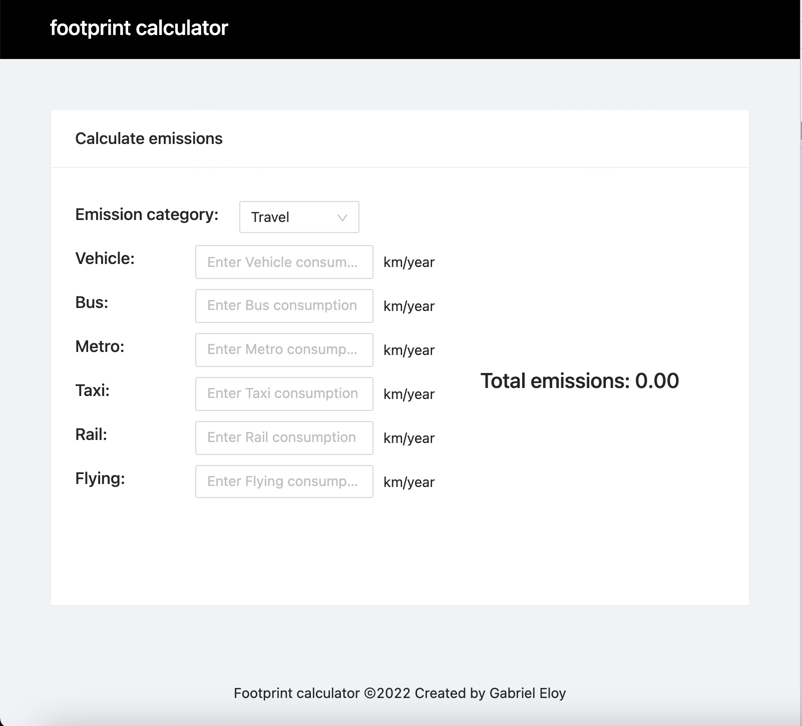
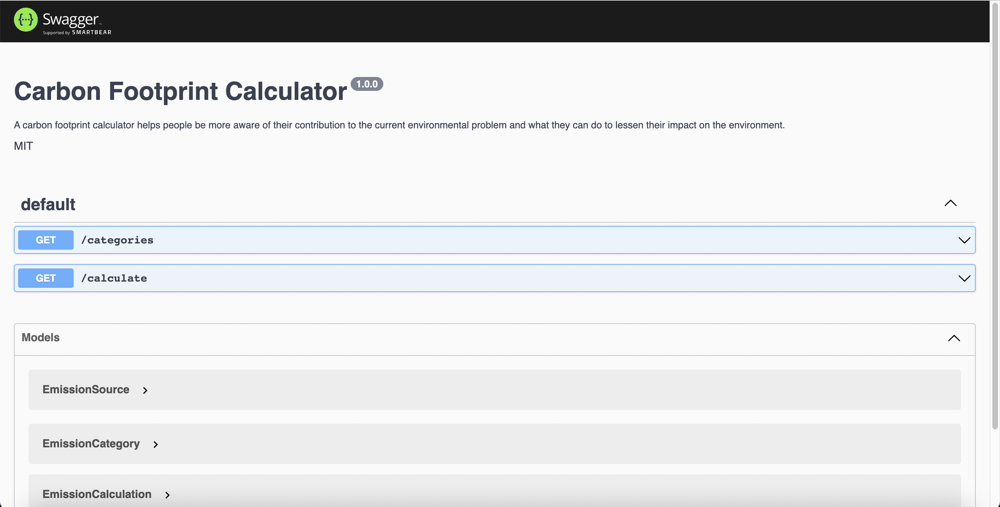

<h1 align="center">
Footprint calculator
</h1>

<p align="center">A carbon footprint calculator helps people be more aware of their contribution to the current environmental problem and what they can do to lessen their impact on the environment.</p>

<p align="center">
  <a target="_blank" rel="noopener noreferrer" href="https://pt-br.reactjs.org/">
   
  </a>
  <a target="_blank" rel="noopener noreferrer" href="https://www.typescriptlang.org/">
    
  </a>
  <a target="_blank" rel="noopener noreferrer" href=https://testing-library.com/docs/react-testing-library/intro">
    
  </a>
  <a target="_blank" rel="noopener noreferrer" href="https://nodejs.org/en/">
    
  </a>
</p>

<div align="center">
    
</div>

<hr>

## Participants

| [](https://github.com/gabrielEloy) |
| :----------------------------------------------------------------------------------------------------------------------------------------------------------------: |

| [Gabriel Eloy](https://github.com/gabrielEloy)

## Getting started

1. Clone this repository;<br />
2. Run `npm run install-dependencies or yarn install-dependencies` at the project's root directory to install dependencies.<br />
3. Run `npm run start` or `yarn start`.<br />
4. Access `localhost:3000` in your browser.<br />

## API Docs

This project is documented using a swagger. To access it, access the api server (which runs by default in localhost:3000)
and request the endpoint `/api-docs`. By doing so, you will be able to access swagger-ui and consume the API's docs

<div align="center">
    
</div>


## Testing

The projects test suite isn't unified. So you must run the front end tests and the back end test separately. To do so, navigate to the application you want to test (client or server) and type the following:

```
yarn test
```

or 


```
npm run test
```